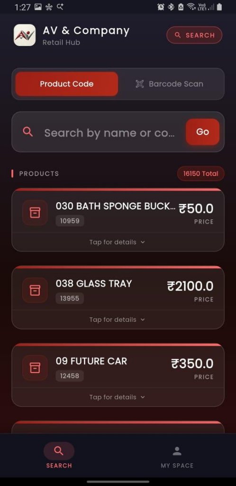
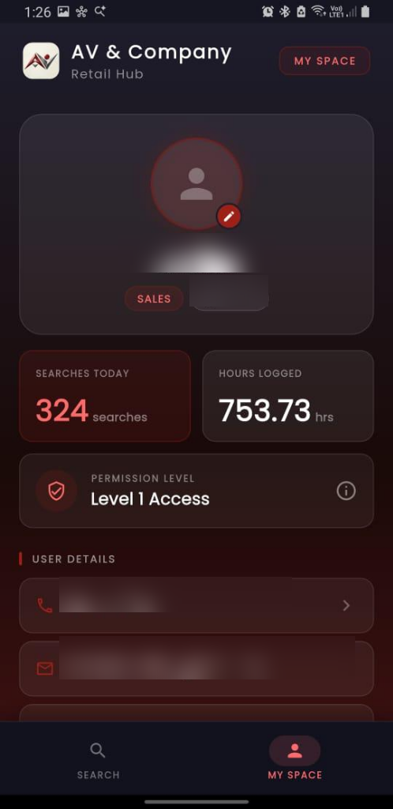
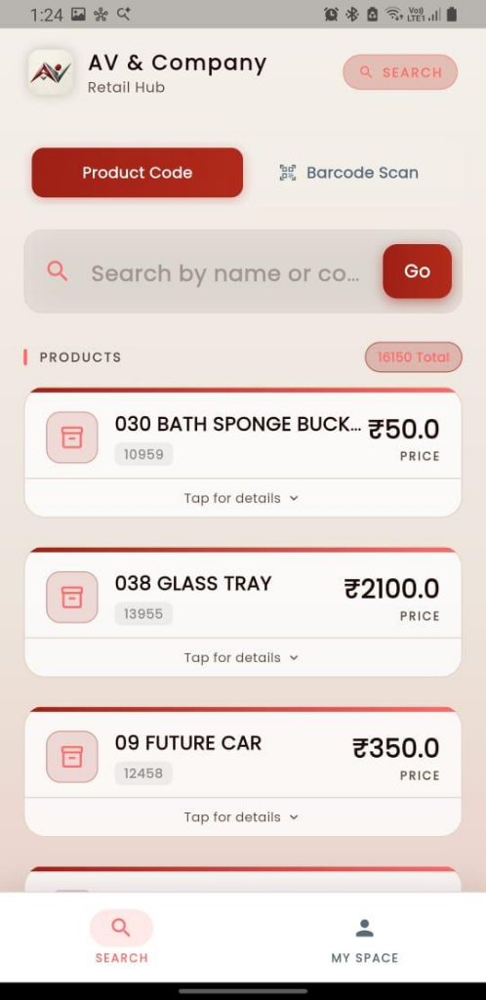

# 🛍️ AV & Company - Product Lookup App

An enterprise-grade, cross-platform retail product lookup and management solution built with **Flutter** (Mobile & Web) and **Django REST Framework** (Python). Designed for retail environments to provide fast product code lookup, multi-tier price checking, barcode scanning, user search analytics, and role-based space management.

---

## 📸 Application Screenshots

| 🌙 Dark Mode Search | 👤 User Profile (My Space) | ☀️ Light Mode Search |
| :---: | :---: | :---: |
|  |  |  |

---

## ✨ Key Features

- 🔍 **Instant Product Lookup**: Search 16,000+ products by Product Code, Barcode, or Name with real-time cached filtering and offline fallback.
- 🏷️ **Multi-Tier Price Display**: Instant view of unit price breakdowns (Price A, Price B, Price C) for retail and wholesale management.
- 📱 **Dual Theme Support**: Beautiful dark mode and crisp light mode themes tailored for low-light inventory rooms or bright sales counters.
- 🔐 **JWT Authentication & Token Security**: Secure token-based authentication with automatic refresh token rotation and session management.
- 📊 **User Workspace Analytics**: Track daily product lookup counts, total logged hours, and permission levels directly in user profiles.
- 🗄️ **Enterprise MSSQL & SQLite Integration**: Connects with Microsoft SQL Server (`pyodbc`) for real-time inventory databases with local caching support.
- 🖥️ **Admin Portal**: Dedicated management interface for uploading inventory updates and managing access levels.

---

## 🛠️ Tech Stack

### Mobile & Admin Frontend
- **Framework**: [Flutter](https://flutter.dev/) (Dart)
- **State & Storage**: `flutter_secure_storage`, `shared_preferences`
- **Networking**: HTTP REST API client with automatic JWT token management

### Backend API
- **Framework**: Python 3.x / Django 5.x / [Django REST Framework](https://www.django-rest-framework.org/)
- **Database**: Microsoft SQL Server (pyodbc) / SQLite (Development)
- **Authentication**: `rest_framework_simplejwt` (JWT bearer auth)

---

## 📁 Repository Structure

```text
av-company-product-lookup/
├── backend/                  # Django REST API Backend
│   ├── api/                  # Product lookup views & MSSQL ODBC connection handler
│   ├── core/                 # Django settings, JWT configuration & URLs
│   ├── upload/               # Media & Excel inventory upload handlers
│   ├── requirements.txt      # Python dependencies
│   └── .env.example          # Template for backend environment variables
├── frontend/                 # Flutter Mobile Client App
│   ├── lib/                  # Dart source (Screens, Widgets, API Services)
│   └── pubspec.yaml          # Flutter dependencies & assets
├── admin_frontend/           # Admin Web Portal Client
├── screenshots/              # Application screenshots & UI previews
└── README.md                 # Project Documentation
```

---

## 🚀 Quick Start Guide

### 1. Backend Setup (Django API)

1. Navigate to the backend directory:
   ```bash
   cd backend
   ```

2. Create and activate a Python virtual environment:
   ```bash
   python -m venv venv
   # Windows:
   venv\Scripts\activate
   # macOS/Linux:
   source venv/bin/activate
   ```

3. Install required dependencies:
   ```bash
   pip install -r requirements.txt
   ```

4. Configure environment variables:
   Copy `.env.example` to `.env` and configure your database connection string and secret key:
   ```bash
   cp .env.example .env
   ```

5. Run migrations and start the Django development server:
   ```bash
   python manage.py migrate
   python manage.py runserver 0.0.0.0:8000
   ```

---

### 2. Frontend Setup (Flutter App)

1. Navigate to the frontend directory:
   ```bash
   cd frontend
   ```

2. Fetch Flutter packages:
   ```bash
   flutter pub get
   ```

3. Launch the app on a connected device or emulator:
   ```bash
   flutter run
   ```

---

## 🔒 Security & Privacy Notice

All sensitive configuration data (database passwords, API secrets, JWT private keys) are managed exclusively through environment variables (`.env`). Local databases, logs, and sensitive personal details have been sanitized and excluded from this repository.

---

## 📝 License

Distributed under the MIT License. See `LICENSE` for details.
